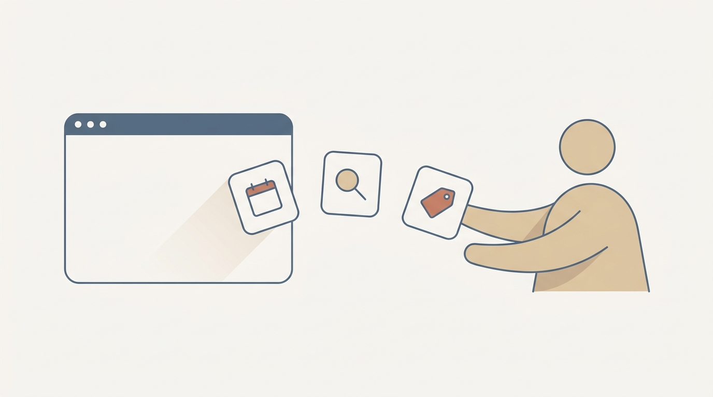

# Claude WebMCP: Agent-Readiness Skill for Claude Code

**Claude WebMCP is a Claude Code skill for deciding whether your site should expose WebMCP tools to AI agents, designing those tools safely, and refusing the claims about them that no evidence supports.**

[](https://claude.ai/claude-code)
[](LICENSE)
[](docs/sources.md)
[](docs/sources.md)

Most sites should not build WebMCP tools yet. This skill tells you that, with reasons, and that is a successful run.

## What WebMCP is, in plain terms

WebMCP is a new browser capability that lets your website hand an AI agent a list of actions it can call directly, like `book_appointment` or `search_products`, instead of the agent squinting at a screenshot and clicking around like a person.

The agent calls the action on your live page, using your visitor's own logged-in session.

That is genuinely useful. It is also pre-standard, off by default in every browser, and has almost no real-world adoption yet. Both halves are true, and most writing about it only tells you one.

## What this skill does

- **Decides whether you should build.** Four fit tests. Real actions, action value, a reachable agent, and capacity to maintain an experimental API. Most sites fail at least two.
- **Shapes the tools if you should.** Three or four tools on one high-value flow, not your whole site.
- **Reviews them for safety.** The annotation contract, the two gates that silently disable everything, and tool output as a prompt-injection surface.
- **Stops you overclaiming.** A three-rung claim ladder separating what Chrome documents, what one vendor benchmark measured, and what nobody has evidence for.
- **Tells you what you can measure.** Which is less than you would hope.

## Why it exists

Almost every WebMCP article currently in circulation makes at least one of these claims. All of them are wrong.

| Circulating claim | Reality |
|---|---|
| It improves your rankings | No Google, Bing, or Microsoft statement links WebMCP to ranking in either direction |
| This is where agent traffic lands | Chrome: *"Clients and browsers must visit a site directly to know if it has callable tools."* No discovery exists |
| It increases conversion | Zero case studies. Zero A/B tests. Zero revenue data. From anyone |
| Register with a directory to get found | Directories exist. No agent client is documented as reading them |
| It uses 89% fewer tokens | A circulating figure with no published methodology |
| Biggest shift in technical SEO since structured data | A practitioner's conditional speculation, quoted with the condition removed |

The skill carries the sourced version of each, so you can say something accurate instead.

## What is actually true

**Chrome's own words:** WebMCP improves *"efficiency, reliability, and task completion"* and is *"more reliable than actuation, which may have numerous steps and leaves each step open to interpretation by the agent."*

**One vendor benchmark** measured agents completing tasks faster, cheaper, and with fewer tokens using WebMCP than by driving the screen. It has not been independently replicated, and the publisher sells agentic-commerce infrastructure without disclosing that in the repo.

**Nobody has measured conversion.** If someone tells you otherwise, ask for the study.

## Who this is for

- **Marketers and founders** being asked whether to "make the site AI-ready" and wanting a real answer.
- **Developers** who need the correct API surface, the two gates that fail silently, and the security guidance in one place.
- **Anyone about to publish** something about WebMCP who would rather not be wrong in front of their audience.

## Installation

```bash
git clone https://github.com/AgriciDaniel/claude-webmcp.git
cp -r claude-webmcp/skills/webmcp ~/.claude/skills/
```

Then in Claude Code:

```
/webmcp should we build webmcp tools for our booking flow
```

## Use it for

```
/webmcp assess    our ecommerce site, we have a configurator and a quote form
/webmcp design    three tools for the checkout flow
/webmcp review    <paste a registerTool call>
/webmcp claims    <paste a draft post or client deck>
/webmcp api       what disables tool registration silently
```

## What is in the box

| Path | What it holds |
|---|---|
| `skills/webmcp/SKILL.md` | The entry point and routing |
| `references/method.md` | Fit tests, tool scoping, claim adjudication, measurement plan |
| `references/claims-and-maturity.md` | The claim ladder. Read this before publishing anything |
| `references/api-reference.md` | Verified WebIDL, both gates, annotation contract, character budgets, Chrome's design rules |
| `references/ecosystem.md` | Which package is official, licence boundaries, naming traps |
| `evals/` | Five synthetic cases including a poor-fit refusal |
| `docs/sources.md` | Every source, its fetch date, and its authority tier |

## How the facts were checked

Five parallel research agents verified every claim against primary sources on 2026-09-05. A three-lane adversarial audit re-checked the result on 2026-09-06 and found six errors, including one inverted fact and two of our own inferences presented as vendor guidance. All six were corrected. The corrections are documented rather than quietly overwritten.

Sources are graded in three tiers: normative and first-party, first-party with a commercial interest, and independent practitioner evidence. See [docs/sources.md](docs/sources.md).

Where the evidence runs out, the skill says `no data`. That happens more than you would expect for a technology this widely written about.

## Honest limitations

- WebMCP is a **Draft Community Group Report**, not a W3C Standard and not on the standards track.
- It is **off by default in every browser.** Chrome and Edge run origin trials. Chrome's ends 2026-11-17.
- **WebKit has formally opposed it.** Mozilla is formally neutral. Neither has endorsed it.
- **Only ChatGPT Work and Codex can call tools today**, in the ChatGPT desktop browser, gated to specific models, unavailable on Enterprise and Edu. Gemini in Chrome is not live.
- **That client sees only imperative, top-level tools.** Declarative form tools are invisible to it.
- Adoption is small. Real deployments exist, including a live Stripe checkout, but no major brand deployment has been verified.
- This skill has **not** been through an independent behavioural evaluation. The eval cases are defined, not run.

## Re-verify by 2026-12-01

WebMCP moves weekly. One annotation in the current set was two days old when these sources were captured. Two pages of Chrome's own documentation are three months out of sync with each other.

Treat an expired horizon as a blocker, not a warning.

## License

MIT. See [LICENSE](LICENSE).

Built by [Daniel Agrici](https://github.com/AgriciDaniel). Open-source Claude Code skills for marketing systems.
